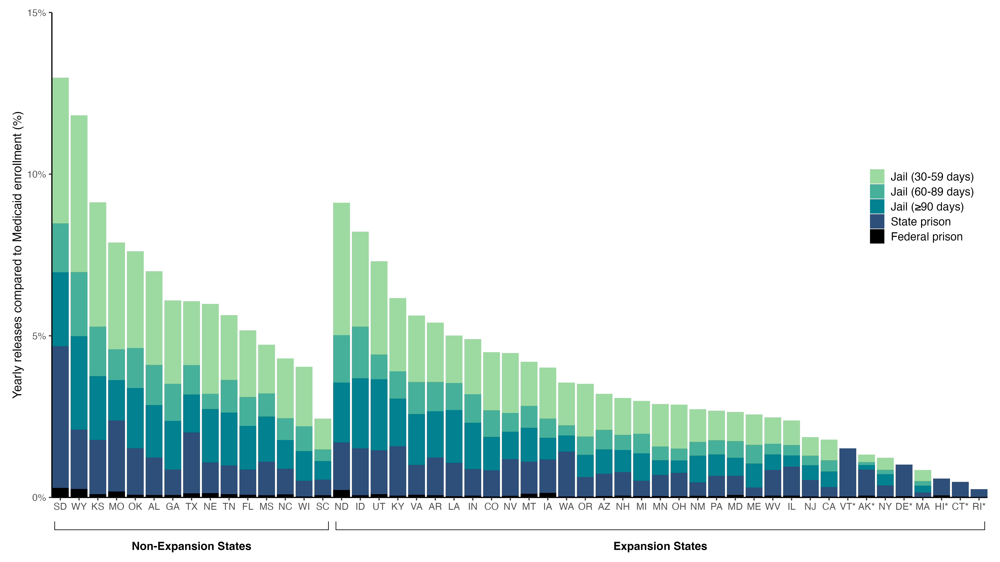

<!-- README.md is generated from README.Rmd. Please edit README.Rmd file -->

```{r, include = FALSE}
knitr::opts_chunk$set(
  collapse = TRUE,
  comment = "#>"
)
```

## Population Health Implications of Medicaid Pre-Release and Transition Services for Incarcerated Populations




This repository, [` incarceration-medicaid
`](https://github.com/sanjaybasu/incarceration-medicaid), contains reproducible code for our manuscript, Population Health Implications of Medicaid Pre-Release and Transition Services for Incarcerated Populations.

## Details

All preprocessing code can be found in the `./preprocess` directory. `./preprocess/standardize_names.R` should be run last to combine files together. `plots.R` should be run after all files are preprocessed to generate summary statistics and figures used in the manuscript.

Due to file size limitations on Github, the files in `./data/raw` and are *not* uploaded to this repository. All data used are referenced in the manuscript.

## Authors
-   [Elizabeth T. Chin](https://etchin.github.io/)
-   [Yiran E. Liu](https://scholar.google.com/citations?user=gh5DeWcAAAAJ)
-   [C. Brandon Ogbunugafor](https://ogbunulab.yale.edu/)
-   [Sanjay Basu](https://scholar.google.com/citations?user=apOctPMAAAAJ)


## Package management

We use [`renv`](https://rstudio.github.io/renv/index.html), but below we also include the relevant information to ensure reproducibility.

```{r, eval=FALSE}
> sessioninfo::session_info(pkgs = "attached")
─ Session info ───────────────────────────────────────────────────────────────────────────────────────────────────────────────────────────────────────────────
 setting  value
 version  R version 4.4.1 (2024-06-14)
 ui       RStudio
 language (EN)
 collate  en_US.UTF-8
 ctype    en_US.UTF-8
 tz       America/Chicago
 date     2024-07-12
 rstudio  2023.03.0+386 Cherry Blossom (desktop)
 pandoc   2.19.2 @ /Applications/RStudio.app/Contents/Resources/app/quarto/bin/tools/ (via rmarkdown)

─ Packages ───────────────────────────────────────────────────────────────────────────────────────────────────────────────────────────────────────────────────
package      * version  date (UTC) lib source
aods3        * 0.4-1.2  2022-07-08 [?] CRAN (R 4.4.1)
bbmle        * 1.0.25.1 2023-12-09 [?] CRAN (R 4.4.1)
colorspace   * 2.1-0    2023-01-23 [?] CRAN (R 4.4.1)
dplyr        * 1.1.4    2023-11-17 [?] CRAN (R 4.4.1)
fiftystater  * 1.0.1    2024-06-26 [?] xgit (https://github.com/wmurphyrd/fiftystater.git@28e7fa5)
forcats      * 1.0.0    2023-01-29 [?] CRAN (R 4.4.1)
future       * 1.33.2   2024-03-26 [?] CRAN (R 4.4.1)
future.apply * 1.11.2   2024-03-28 [?] CRAN (R 4.4.1)
ggplot2      * 3.5.1    2024-04-23 [?] CRAN (R 4.4.1)
ggpubr       * 0.6.0    2023-02-10 [?] CRAN (R 4.4.1)
glmmTMB      * 1.1.9    2024-03-20 [?] CRAN (R 4.4.1)
haven        * 2.5.4    2023-11-30 [?] CRAN (R 4.4.1)
here         * 1.0.1    2020-12-13 [?] CRAN (R 4.4.1)
jtools       * 2.2.2    2023-07-11 [?] CRAN (R 4.4.1)
lubridate    * 1.9.3    2023-09-27 [?] CRAN (R 4.4.1)
Matrix       * 1.7-0    2024-04-26 [?] CRAN (R 4.4.1)
naniar       * 1.1.0    2024-03-05 [?] CRAN (R 4.4.1)
nhanesA      * 1.1      2024-04-24 [?] CRAN (R 4.4.1)
purrr        * 1.0.2    2023-08-10 [?] CRAN (R 4.4.1)
readr        * 2.1.5    2024-01-10 [?] CRAN (R 4.4.1)
rlang        * 1.1.4    2024-06-04 [?] CRAN (R 4.4.1)
sf           * 1.0-16   2024-03-24 [?] CRAN (R 4.4.1)
srvyr        * 1.2.0    2023-02-21 [?] CRAN (R 4.4.1)
stringr      * 1.5.1    2023-11-14 [?] CRAN (R 4.4.1)
survey       * 4.4-2    2024-03-20 [?] CRAN (R 4.4.1)
survival     * 3.6-4    2024-04-24 [?] CRAN (R 4.4.1)
tibble       * 3.2.1    2023-03-20 [?] CRAN (R 4.4.1)
tidycensus   * 1.6.3    2024-03-20 [?] CRAN (R 4.4.1)
tidyr        * 1.3.1    2024-01-24 [?] CRAN (R 4.4.1)
tidyverse    * 2.0.0    2023-02-22 [?] CRAN (R 4.4.1)
wesanderson  * 0.3.7    2023-10-31 [?] CRAN (R 4.4.1)
```